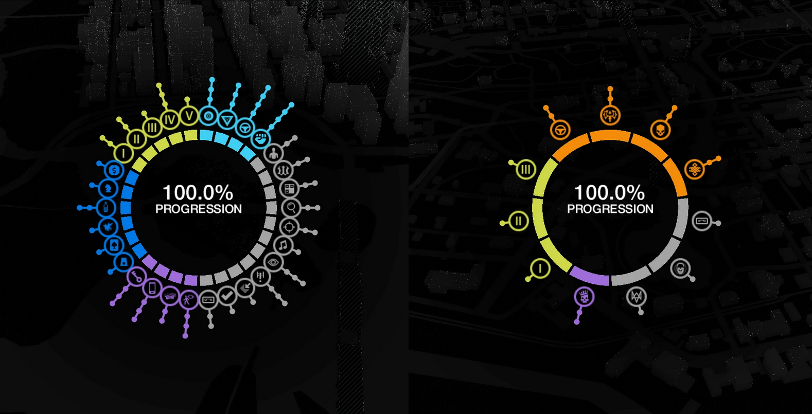

Для сборок от группы RELOADED, включая репаки FitGirl, сохранения находятся в общесистемной скрытой директории ProgramData. Путь к файлам: C:\ProgramData\Orbit\274\RLD!. Внутри вы обнаружите файлы с именами Save*.sav и конфигурационный файл saves.ini.

Для сборок от группы 3DM директория с прогрессом расположена непосредственно внутри папки с установленной игрой. Перейдите в каталог установки и откройте подпапку bin. Файлы сохранений имеют расширение .save и названия вида *.save.
